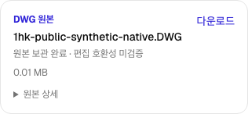

# DWG 원본 업로드 — 구현·검증 결과

2026-09-06. **DWG 원본 보관 단계 완료, 전체 DWG 편집·재저장·납품 목표는 진행 중. 운영 배포하지 않음.**

## 구현한 사용자 흐름

- 기존 프로젝트 파일 화면에 `DWG 원본` 선택을 추가했다. 기존 `other` 파일은 바꾸지 않았다.
- 실제 저장된 바이트의 6바이트 ASCII 헤더와 전체 SHA-256·크기를 서버가 확인한다. 헤더 식별은 CAD 파싱·편집 호환성 인증이 아니다.
- 목록은 `원본 보관 완료 · 편집 호환성 미검증`으로 표시한다. 미검증 DWG를 기존 PDF/IFC 생성, DXF 가져오기 또는 네이티브 내보내기 경로로 넘기지 않는다.
- 다른 DWG 파일을 같은 종류라는 이유로 자동 개정 연결하지 않는다. 같은 업로드 재처리는 하나의 파일로 유지하며, 권한 회수 후 재처리는 차단한다.
- 잘못된 파일은 등록하지 않고, 로컬 복구 기록을 지운 뒤 다른 파일을 올릴 수 있다. 그 작업으로 이미 보관된 원본 바이트를 삭제하지 않는다.
- DWG MIME 정규화를 실제 TUS File/fingerprint 조회에도 적용했다. 파일명·크기·수정 시각·전송 주소와 기존 프로젝트/경로 검증은 유지한다. 기존 라이브러리의 식별 알고리즘을 재사용했고 새 의존성은 추가하지 않았다.

## 최종 검증

작업 디렉터리: `platform/`. 모든 실제 서버 검증은 마커로 보호된 폐기 가능한 로컬 Supabase에서 실행했다.

| 검증 | 결과 |
| --- | --- |
| 업로드·복구·스키마·화면·마이그레이션·실행기 집중 테스트 | 167 통과, 실패/건너뜀 0 |
| 타입 검사, 앱 프로덕션 빌드, 협업 서버 빌드 | 통과 |
| M1 실제 PostgreSQL: 권한·재처리·동시 요청·개정 분리·미검증 원본 거절 | 통과 |
| M2 실제 PostgreSQL: 기존 PDF 연결 회귀 | 통과 |
| M5 실제 PostgreSQL/Storage: 원본 보존·변경 차단 회귀 | 통과 |
| M5 보조 검사 | 2 통과 |
| 조건부 환경 안내 검사 | 2 건너뜀; 실제 M2/M5 검증은 모두 실행됨 |
| Chromium: 잘못된 파일 거절/복구, DWG·PDF 업로드, 모바일, Viewer 다운로드 | 2 통과, 10.4초 |
| 독립 태스크 검토 및 별도 최종 통합 검토 | 발견 사항 수정 후 승인 |

최종 실제 실행 명령:

```sh
NODE_OPTIONS=--no-experimental-webstorage node scripts/run-drawing-workspace-m1-e2e.mjs --profile=dwg-source
```

최종 집중 테스트:

```sh
NODE_OPTIONS=--no-experimental-webstorage node --test tests/project-upload-finalization-migration.test.mjs tests/project-file-upload-verifier.test.mjs tests/project-dwg-source.test.mjs tests/project-file-upload-resume.test.mjs tests/drawing-workspace-entry-flow.test.mjs tests/drawing-workspace-m1-release-harness.test.mjs
```

MIME 재선택 회귀는 실제 설치된 브라우저 TUS SDK의 fingerprint 조회, URL 저장, 파일 읽기와 POST/HEAD/PATCH 상태 흐름을 실행했다. HTTP와 URL 저장만 메모리 테스트 경계로 대체했으며, 실제 브라우저 네트워크 단절 실험이라고 주장하지 않는다. 기존 세션을 찾지 못하는 RED를 재현했고 수정 후 동일 경로·단일 POST·재개 HEAD·전송 바이트 일치를 검증했다.

테스트 작성 중 두 기대값도 바로잡았다: 실제 원본 거절 코드 `P1R01`, PDF 성공 후 작업실 시작 화면으로 이동하는 기존 동작. 이를 맞추기 위해 제품 권한이나 원본 정책을 변경하지 않았다.

## 원본·화면 근거

고객 파일이 아닌 기존 생성 테스트 도면을 사용했다.

- 원본: `docs/superpowers/evidence/2026-09-06-native-dwg-export-jobs/native.dwg`
- 크기: **13,387 bytes**, 헤더: **AC1024**
- 원본/등록 메타데이터/Owner 및 Viewer 다운로드 SHA-256: `7d94793d0d35631bd7068971202c686f076659f4836205aa88c3894d1bf77201`




최종 파일·검증 로그의 해시는 [evidence.json](2026-09-06-dwg-source-ingestion/evidence.json)에 기록했다. 인증 정보와 원시 서버 로그는 공개 증거 폴더에 복사하지 않았다.

## 한계와 다음 개발

- 이번 결과는 원본 업로드·보관·권한·복구 경로다. 고객 DWG의 객체 가져오기, 브라우저 편집, 승인된 재저장, 수신 CAD에서의 납품 검증은 아직 완료되지 않았다.
- 다음 R4 작업은 서비스가 관리하는 DWG 호환성/가져오기 작업과 객체-네이티브 핸들 연결이다. 기존 선택 핸들 CLI와 새 DWG 출력 기능만으로 고객 DWG 전체 지원을 완료로 표시하지 않는다.
- M1 최소 인증 스키마에서는 실제 익명/권한 회수 거절을 검증했다. 삭제·정지된 계정에 대한 생산 SQL 검사는 포함되지만 해당 두 상태 변경을 실제 인증 서비스로 재현한 별도 검증은 이번 증거에 포함하지 않는다.
- 기존 theme 쿠키 서명 경고, 번들 크기/React Router 미래 플래그·중복 import 경고, 초기 마이그레이션 NOTICE, 색상 환경 경고는 남아 있다. 실패 없는 실행과 경고 없는 실행을 혼동하지 않는다.
- 임시 검증 서버·데이터만 정리했다. 기존 사용자 변경, 원본, 미리보기는 보존했다. 커밋·푸시·운영 DB 변경·배포·유료 계약은 하지 않았다.
- 별도 승인된 운영 반영 시 순서는 **DB 마이그레이션 → 업로드 검증 Edge 함수 → 앱**이다. 마이그레이션은 `20260905210241_drawing_dwg_verified_source_ingestion.sql`이다.
