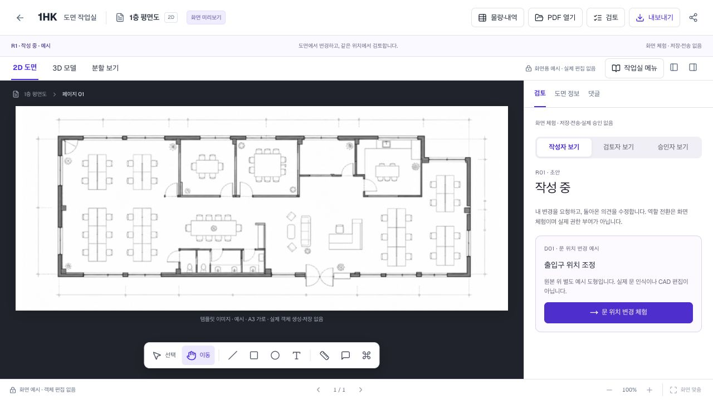
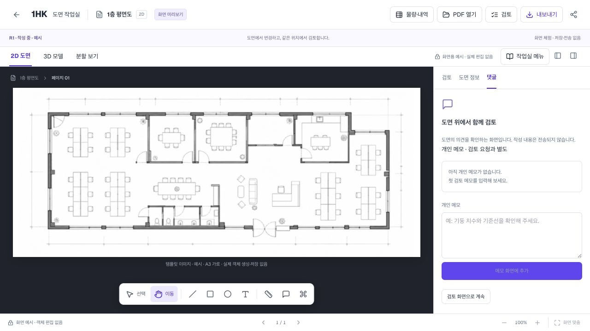

# 1HK 메인 작업실 재기획 — 도면 위에서 작성하고 검토하기

2026-09-09 · 제안 초안. 구현·승인 완료 문서가 아니다. 이번 작업은 현황 확인과 기획이며 애플리케이션 코드는 수정하지 않았다.

## 1. 판단

추천은 **하나의 도면 작업실 + 작성/검토 두 모드 + 위치에 연결된 변경 항목과 대화**다. 별도 채팅 페이지나 별도 검토 마법사를 만들지 않는다. 목록은 도면의 위치를 찾는 수단이고, 도면의 위치가 대화·결정·근거의 중심이다.

사용자가 전달한 대화 캡처는 아이디어 자료로 참고했다. 두 번째 데스크톱 이미지는 제공 경로에서 찾을 수 없어 확인하지 못했다. 아래 화면 진단은 현재 실행 중인 로컬 미리보기의 사무실 템플릿에 한정한다. 사용자 업로드 PDF/DWG나 운영 화면의 실사용 검증 결과가 아니다.

## 2. 이번에 직접 확인한 화면

### 1단계 — 도면 진입 / 개선 필요

- 장점: 중앙 도면과 하단 도구가 유지되고 오른쪽 패널을 사용할 공간이 있다. 전체 화면을 새로 만들 필요는 없다.
- 관찰: 작성 중인데 오른쪽은 검토 탭으로 시작하며 작성자/검토자/승인자 체험 전환과 D01 문 변경 예시를 먼저 보여준다.
- 관찰: 상단 검토 버튼과 오른쪽 검토 탭이 함께 있고, 세 줄의 상단 영역에서 업무·도면 표시 방식·체험 안내가 경쟁한다.
- 해석: 사용자는 ‘도면에서 무엇을 할지’보다 ‘어떤 체험 경로를 선택할지’를 먼저 이해해야 한다. 실제 사용자 테스트로 영향 크기를 확인할 필요가 있다.
- 접근성 위험: 작은 아이콘과 옅고 작은 설명문은 조작·가독성 확인이 필요하다. 이번 캡처만으로 대비비나 키보드/스크린리더 적합성을 확정하지 않는다.

### 2단계 — 댓글 탭 진입 / 개선 필요

- 장점: 댓글 탭을 열어도 도면은 같은 화면에 남는다.
- 관찰: ‘댓글’ 안에는 ‘개인 메모 · 검토 요청과 별도’가 표시되고 다시 ‘검토 화면으로 계속’을 눌러야 한다.
- 해석: 업무 의견을 남기려는 사람에게 개인 메모와 검토의 관계가 불명확하다. 도면의 변경 위치, 해당 대화, 수정 요청의 연결을 주 화면에서 보여주는 편이 낫다.
- 한계: 이번에는 의견 작성·전송, 변경 생성, 승인 동작을 실행하지 않았다. 승인·재검토 전체 흐름을 브라우저 검증했다는 의미가 아니다.

## 3. 선택지

| 방향 | 장점 | 한계 | 판단 |
|---|---|---|---|
| 같은 도면에서 작성/검토 전환 | 위치와 대화를 유지하고 역할별 도구만 바꿀 수 있다 | 모드와 개정 기준을 명확히 설계해야 한다 | 추천 |
| 도면 옆에 상시 채팅창 | 익숙하고 대화 시작이 쉽다 | 최신 메시지가 중요 변경을 밀어내고 도면 위치·검토 범위가 묻힌다 | 변경 상세 안의 대화로만 활용 |
| 작성 페이지와 검토 페이지 분리 | 각 화면이 단순해진다 | 위치·확대·의견 문맥을 잃고 왕복이 늘어난다 | 주 작업실에는 적용하지 않음 |

## 4. 추천 화면 구조

| 영역 | 작성 모드 | 검토 모드 |
|---|---|---|
| 상단 | 프로젝트/도면/현재 개정·보관 상태, 작성/검토 전환, 검토 요청 | 같은 문맥, 비교 기준, 현재 검토 범위와 역할에 맞는 결정 |
| 왼쪽 | 페이지·레이어. 블록/스타일은 필요할 때 펼침 | 페이지별 미확인 변경 개수. 레이어는 접힘 |
| 중앙 | 원본 도면 + 편집 가능한 오버레이 | 같은 도면 + 변경 강조 + 위치 핀 |
| 오른쪽 | 선택 객체의 속성. 수정 중인 의견은 고정 가능 | 변경 목록 → 선택한 변경의 상세·대화·처리 상태 |
| 하단 | 선택·이동·선·도형·텍스트·치수, 나머지 더보기 | 이동·확대·측정·영역 의견·이전/다음 변경 |

- ‘조회’는 별도 세 번째 페이지를 만들지 않는다. 보기 전용 권한에서도 같은 작업실을 열되 편집과 결정 행동을 제한한다.
- 모드 전환 자체는 페이지·확대·위치·선택·입력 중 대화를 초기화하지 않는다. 다른 변경을 찾아갈 때만 해당 위치로 이동하고 ‘이전 위치’로 복귀할 수 있게 한다.
- 2D/3D/분할은 표시 방식 선택으로 축소한다. IFC가 없는 도면에서는 불필요한 상시 선택지를 줄인다.
- 물량·내역은 프로젝트 업무 및 선택 변경의 ‘영향 확인’에 연결하고 메인 작성 도구와 동등한 강조를 하지 않는다. 공유·납품은 상단 보조 메뉴에 유지한다.
- 체험 역할 전환과 D01 고정 체험은 제품 작업 영역에서 빼고 접힌 ‘데모 설정/따라 해보기’로 옮긴다. 화면 예시·미전송 안내는 명확한 한 곳과 관련 행동의 안내에 유지한다.

## 5. 말풍선의 의미와 상호작용

세 가지를 다른 표시로 구분한다.

1. **실시간 커서**: 지금 같은 도면·개정을 보는 접속자. 임시 표시이며 변경 이력이 아니다.
2. **변경 핀**: 저장된 변경 항목의 위치. 작성자가 나가도 남고 변경 유형·상태·작성자 정보를 가진다.
3. **의견 표시**: 변경 항목에 연결된 대화 수. 변경 없는 질문은 별도의 위치 의견으로 등록할 수 있다.

기본 화면에는 작은 핀과 필요한 상태만 표시한다. 마우스를 올리거나 키보드로 포커스하면 ‘작성자 · 변경 요약 · 시각 · 검토 상태’가 짧게 나타난다. 클릭/탭하면 오른쪽에 상세와 대화가 고정되어 수정 중에도 볼 수 있다. hover만으로 중요한 행동을 제공하지 않는다.

서로 가까운 핀은 축소 시 개수로 묶는다. 선택 항목과 미처리 항목을 우선하고, 완료 항목은 기본 접기 + 필터로 다시 보기로 처리한다. 사람별 색을 변경 유형 색과 혼용하지 않는다. 프로필만 보고 실제 변경자를 단정하지 않도록 ‘변경자’, ‘등록자’, ‘의견 작성자’를 구별한다.

## 6. 변경 강조와 비교 기준

- 검토 중 기본은 읽을 수 있는 중성 톤 배경 + 강조된 변경이다. 도면을 지나치게 흐리게 만들지 않는다.
- 원본색 유지 토글을 둔다. 설비 도면 등 색 자체가 정보를 갖는 원본을 일괄 흑백으로만 보여주지 않는다.
- 추가/수정/삭제는 색뿐 아니라 텍스트·기호·선 패턴을 함께 사용한다. 삭제는 사라진 위치를 이전 형상의 점선으로 보여준다.
- 항상 ‘기준 R1 → 검토 R2’ 또는 ‘기준 R2 → 작성 중’처럼 비교 대상을 표시한다. ‘최신’으로 조용히 바꾸지 않는다.
- 최초 도면처럼 기준 개정이 없으면 ‘비교 기준 없음’을 표시하고 변경 감지를 꾸며내지 않는다.
- 위치를 복원할 수 없는 변경은 ‘위치 확인 필요’ 목록에 남긴다. 엉뚱한 도면 위치로 자동 연결하지 않는다.

## 7. 업무 흐름

1. 작성자가 객체를 편집하거나 PDF 위 변경 영역을 표시한다.
2. 관련 편집을 ‘출입문 위치 조정’처럼 하나의 변경 항목으로 묶고 사유를 적는다. 마우스 이동 하나마다 업무 항목을 만들지 않는다.
3. 검토 모드에서 변경 전후와 검토 대상 페이지·항목 수를 확인하고 검토자를 지정한다.
4. 요청 시 대상 개정을 고정한다. 검토자는 알림에서 같은 도면·개정·위치로 들어온다.
5. 핀/목록을 선택하면 동일한 상세·대화가 열린다. 일반 댓글과 담당자·처리 상태가 있는 수정 요청은 같은 문맥에서 구별한다.
6. 수정 요청을 받은 작성자는 같은 위치에서 새 개정의 편집을 시작한다. 이전 요청·대화·기준은 기록으로 남는다.
7. 검토 완료는 Reviewer, 최종 승인은 Approver가 한다. 댓글 해결, 변경 항목 확인, 개정 승인, 물량·금액 확정은 서로 다른 사건이다.
8. 승인 이후에는 고정된 범위로 공유·납품한다. 일부 페이지 검토가 전체 도면 승인처럼 보이지 않도록 범위를 명시한다.

‘변경 항목’은 객체/영역 단위다. V2의 ‘변경 회차’는 여러 도면의 특정 개정과 업무 변경을 묶는 프로젝트 단위다. 모든 선 편집에 회차 등록을 요구하지 않는다. 프로젝트 이력에서 항목을 누르면 같은 작업실 위치로 돌아온다.

## 8. 기술 범위와 기존 코드 재사용

이번 화면 단계에서는 기존 React 패널, 도면 렌더러, 오버레이, 검토 상태 및 위치 연결을 재사용한다. 새 협업 서버나 CAD 엔진을 이 화면 기획 때문에 추가하지 않는다.

운영용 작업실과 로컬 PDF 미리보기는 별도의 화면 구성이므로 둘을 혼동하지 않는다. 운영용 `drawing-workspace.tsx`에는 이미 author/review/quantity 상태와 패널 전환 함수가 있다(약 1760–1820행). `drawing-canvas.client.tsx`에는 이슈 영역 선택과 협업 오버레이도 있다(약 5016–5065행). 이는 코드 관찰이며 운영 환경에서 정상 동작을 확인했다는 의미가 아니다. 향후 화면 구현은 미리보기에서 검증한 모드·위치·대화 규칙을 운영 화면에도 일관되게 적용해야 하며, 세 번째 독립 작업실을 만들지 않는다.

- `drawing-pdf-screen-preview.tsx`: 화면·도면·패널 문맥을 유지하는 기반. 현재 infoTab 기본값은 review다. openReview는 다른 패널을 닫고 2D로 전환하며 locateReview는 화면 맞춤을 호출한다. 단순 모드 전환과 명시적 위치 찾기를 분리할 대상이다.
- `drawing-review-loop.tsx`: 역할별 검토/승인, 개정 기록을 재사용한다. 현재 target 1개인 구조만으로는 여러 변경·여러 페이지를 묶은 검토가 완성되지 않는다.
- `drawing-screen-object-preview.tsx`: 위치 오버레이와 선택 표현을 재사용한다. PDF 이미지 속 선 자체를 CAD 객체처럼 수정할 수 있다는 뜻은 아니다.
- 프로젝트 변경 이력·공유·납품은 같은 도면/개정/변경 항목을 참조하도록 연결한다. 화면만 통합하고 데이터의 공개 범위나 승인 상태를 합쳐서는 안 된다.

난도는 분리해서 본다. 위치 핀·요약·대화·화면 전환은 기존 기반을 활용하는 UI 작업이다. PDF 두 장의 정확한 정렬·차이 판정, 외부 DWG의 의미 있는 객체 비교·원본 작성자 식별, 실제 DWG 재저장은 별도 기능 과제다. 자동 판별 근거가 없으면 ‘직접 등록한 변경’으로 표시해야 한다.

## 9. 다음 화면 구현 범위와 통과 기준

먼저 서로 다른 페이지에 추가·수정·삭제 세 항목이 있고, 의견 없는 변경/일반 질문/수정 요청을 구별할 수 있는 하나의 화면 시나리오를 만든다. 승인·납품 화면을 더 늘리기 전에 이 중심 흐름을 검증한다.

- 작성/검토 전환 후 같은 도면·페이지·확대·위치를 유지한다.
- 핀과 오른쪽 목록은 같은 항목을 선택하고 같은 대화를 보여준다.
- 삭제 변경도 비교에서 위치를 확인할 수 있다.
- 핀이 많은 상태에서 도면을 가리지 않고 필터·묶음으로 찾을 수 있다.
- 검토 기준 개정과 작성 중 개정이 다를 때 명시하고 요청 내용을 덮어쓰지 않는다.
- 미처리 수정 요청에서 새 개정 수정, 재검토까지 위치와 대화가 이어진다.
- Viewer에게 편집/승인 행동을 제공하지 않으며, 외부 공유 범위 밖의 내부 대화·작성자 정보를 노출하지 않는다.
- 키보드와 터치로도 상세·대화·닫기·포커스 복귀가 가능하다. 화면 협소 시 오른쪽 상세는 접이식 시트로 바뀐다.
- 비교 기준 없음·변경 없음·원본 누락·위치 불일치·보관 실패를 정상 화면만큼 명확히 표시한다.
- 신규 사용자에게 설명 없이 요청한 변경을 찾고 수정 의견을 남겨 보도록 하여 탐색 행동과 혼동을 관찰한다. 이는 목표이며 현재 검증 성과가 아니다.

## 10. 참고 근거와 한계

- [Figma — View and manage comments](https://help.figma.com/hc/en-us/articles/360041547593-View-and-manage-comments): 위치 핀, hover 요약, 클릭 상세, 밀집 시 묶음, 목록에서 해당 위치 이동을 제공한다. 이 상호작용 원리를 참고하며 이름·화면을 복제하지 않는다.
- [Autodesk — Drawing Compare](https://help.autodesk.com/cloudhelp/ENU/AutoCAD-Web-Help/files/File-Management/DRAWING_COMPARE.html): 비교 기준을 선택하고 색과 변경 구름으로 차이를 강조하며, 비교 중 작성 도구를 제한하는 사례다. 1HK에 해당 기능이 구현됐다는 증거가 아니다.
- [Yjs — Awareness & Presence](https://docs.yjs.dev/getting-started/adding-awareness): 접속/커서 정보는 세션을 넘겨 보존하는 문서 변경 이력과 구분된다. 이 문서 인용은 Yjs 신규 도입 결정이 아니다.

디자인 감사 스킬에 따라 현재 화면의 직접 캡처를 먼저 확인하고, 관찰과 설계 가설을 구분했다. 이번 기획은 기존 전체 A–G + V2 목표를 삭제하는 안이 아니라 메인 작업실의 우선순위를 재정렬하는 안이다.
