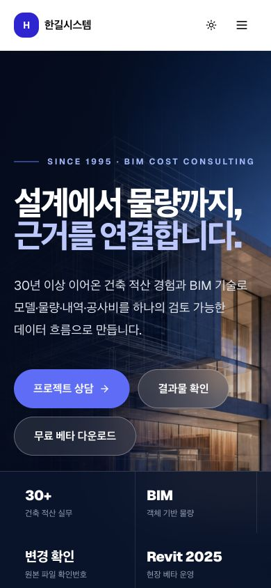
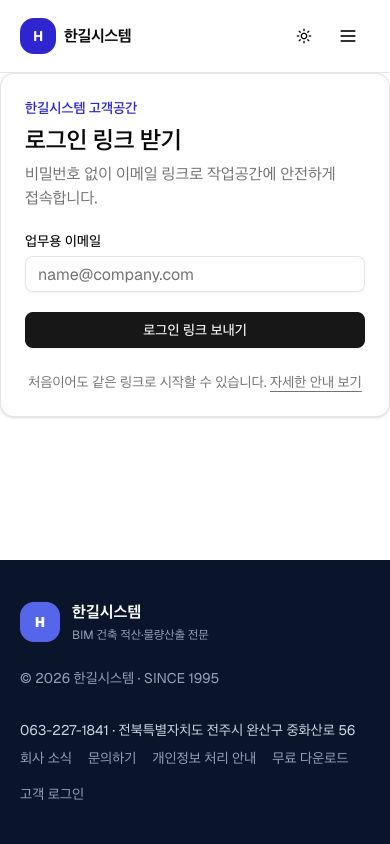
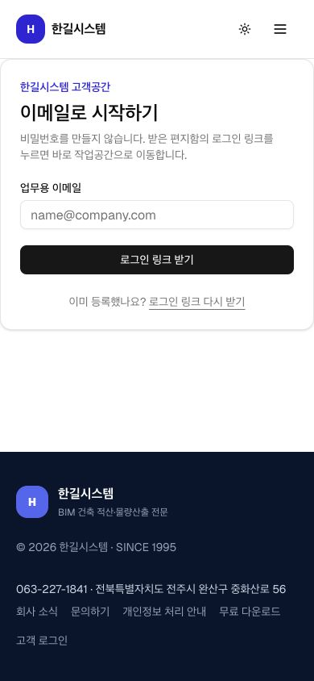

# Lukas QTO 모바일 UX 감사

감사일: 2026-08-16  
대상: 공개 첫 화면 → 이메일 로그인 → 고객 프로젝트 진입  
기준 화면: 390×844 모바일 뷰포트

## 전체 판단

공개 첫 화면과 이메일 로그인은 시각적 위계와 대비가 안정적이다. 가장 큰 문제는 장식이 아니라 업무 연결이었다. 물량 승인 대기 건을 검토 화면으로 안내하지만 실제 승인 입력은 물량 화면에 있었고, 전문 CSV 두 개와 결정 선택이 일반 고객에게 충분히 설명되지 않았다.

## 단계별 결과

### 1. 공개 첫 화면 — 양호

- 강점: 한 문장 가치 제안, 큰 제목, 충분한 대비가 첫 화면에서 잘 보인다.
- 위험: `프로젝트 상담`, `결과물 확인`, `무료 베타 다운로드` 세 행동이 동시에 강조돼 처음 온 사용자는 무엇부터 해야 할지 망설일 수 있다.
- 권장: 영업 고객은 `프로젝트 상담`, 프로그램 시험 사용자는 `무료 베타 다운로드`로 목적을 구분해 보조 설명을 붙인다.

### 2. 고객 로그인 — 양호

- 강점: 입력 하나와 버튼 하나로 짧고, 비밀번호가 없다는 설명도 명확하다.
- 위험: 처음 방문과 기존 고객이 같은 방식인데 별도 `자세한 안내 보기` 화면이 다시 같은 폼을 보여 중복처럼 느껴진다.
- 수정: 테마 버튼에 읽을 수 있는 이름을 추가하고 메뉴를 한국어로 바꿨다. 한국어를 기본 문서 언어로 지정했다.

### 3. 처음 이용 안내 — 주의

- 문제: 로그인 화면과 거의 같은 폼이라 한 단계를 더 거친 이유가 약하다.
- 다음 개선: 이 화면을 별도 가입 화면으로 두지 말고, `이메일 입력 → 받은 메일 클릭 → 프로젝트 열기` 3단계 도움말로 전환한다.

### 4. 프로젝트 업무 — 코드 검증 후 핵심 수정 완료

- 물량 승인 대기는 이제 물량 화면의 해당 위치로, 자동 점검·메모 대기는 검토 화면으로 안내한다.
- 모바일 하단 메뉴에서 물량 대기와 검토 대기를 따로 표시한다.
- 재방문 고객은 새 프로젝트 폼보다 기존 프로젝트 목록을 먼저 본다.
- 파일 종류를 고르면 설명과 허용 확장자가 바뀌고, 업로드 중 중복 제출을 막는다.
- 파일 종류를 바꾸면 이전 선택 파일을 지우고, 서버도 IFC·CSV·Excel 확장자를 다시 확인한다.
- 산출 입력 7종을 IFC → QTO → 객체별 수량표 → 연결표 → 계산 근거 3종 순서로 한 단계씩 안내한다.
- 결과/근거 CSV를 `① 물량 결과`, `② 계산 근거`처럼 보이는 라벨로 설명한다.
- 결정 기본값을 없애고 `승인 / 수정 필요 / 나중에 검토` 중 하나를 직접 고르게 한다. `수정 필요`는 이유 메모가 필수다.
- `나중에 검토`를 선택한 항목은 대기 건수와 다음 할 일에서 사라지지 않는다.
- `물량 확인 대기`를 누르면 섹션 상단이 아니라 실제 첫 대기 카드로 이동한다.
- 새 프로젝트 저장 오류가 나면 접힌 생성 영역을 자동으로 열어 오류를 바로 보여준다.
- IFC 모바일 화면은 요소를 선택하면 속성 영역으로 이동하며 검색·상태·오류를 보조기기에 알린다.

### 5. 자재 기록 — 초급 흐름 우선으로 정리

- 첫 화면 명칭을 `현장 자재 기록 · 시험 운영`으로 바꾸고 설치 프로그램과의 관계를 쉬운 문장으로 설명한다.
- 입력 순서를 `자재계획 → 발주·입고·설치·계산서 → 탄소 정보`로 바꿨다.
- EPD·PCR·A1-A3 같은 전문 입력은 `탄소 정보 입력 (고급)` 안에 접어 기본 작업을 방해하지 않게 했다.
- 저장 성공 시 `기록되었습니다` 상태 메시지를 표시한다.

## 접근성 확인 범위

화면 캡처와 DOM 구조로 대비 위험, 레이블, 상태 알림, 터치 크기를 확인했다. 실제 로그인 세션이 없어 인증 후 화면을 브라우저로 캡처하지 못했다. 키보드 전 구간, 스크린리더 발음, 200% 확대, 실제 iOS/Android 파일 선택기는 별도 실기 검증이 필요하다.

## 검증 결과

- TypeScript 타입 검사 통과
- 공개 화면 계약 테스트 11/11 통과
- 물량·개정·근거 도메인 테스트 19/19 통과
- 프로덕션 빌드 통과
